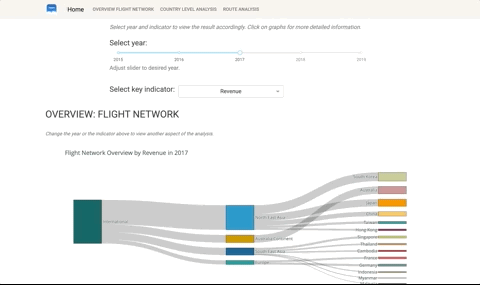

## The Data & Application
The application was inspired by [Dash app Gallery](https://github.com/devparra/baseball-hist-dash), using Plotly's, faculty.ai's Dash Bootstrap 
Components and Pandas, based on a making-up data of operation flight in 2015-2019. 
## The analysis
The analysis breaks down flight network performance by indicators, including:
* Passengers
* Revenue
* Flights
* Others: Load rate, Average revenue per pax, Cargo revenue, Mail revenue, Cargo weight.
#### The analysis structure includes three main parts:
* _Overview:_ Key indicators performance by regions and countries.
* _Country level analysis:_ The performance, the growth and changes through
time, the seasonal analysis (peak and low) of each country.
* _Route analysis:_ The performance, the growth and changes through
time, the seasonal analysis (peak and low) of each route.

Screenshot for the app:

### Application deployed on Heroku [here](https://sample-flight-analytics.herokuapp.com/flight-network-analysis)
